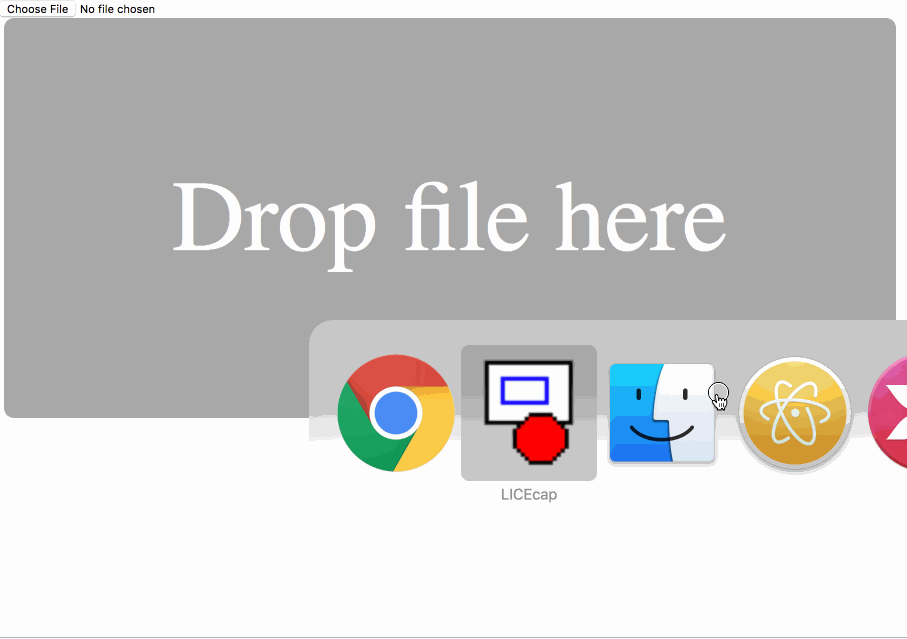
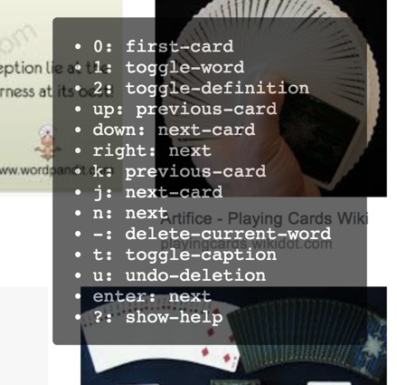

# cram-vocabulary

[Quiz モードはこんな感じ(動画)](https://www.youtube.com/watch?v=gRUXP2YlPEY)  
[このアプリを作った背景、Anki との棲み分けについての僕の考えの Tweet](https://twitter.com/t9md/status/1096001284811874304)  




<!-- TOC START min:1 max:3 link:true update:true -->
- [cram-vocabulary](#cram-vocabulary)
- [これは何？](#これは何)
- [おおまかな流れ](#おおまかな流れ)
  - [環境](#環境)
  - [前準備](#前準備)
- [チュートリアル](#チュートリアル)
  - [1.画像集め](#1画像集め)
  - [2. 画像を見ながら単語学習](#2-画像を見ながら単語学習)
  - [3. 補足説明](#3-補足説明)
    - [`bach-image-retrieve.py`](#bach-image-retrievepy)
    - [slideshow app](#slideshow-app)
    - [Advanced: 上級編](#advanced-上級編)
- [CHANGES](#changes)

<!-- TOC END -->

# これは何？

英単語を大量に覚えたい時、初期の詰め込み学習を助けるツール。  
具体的には、英単語の画像イメージを見ながら単語を詰め込めるアプリを提供する。  
Intensive な詰め込みを加速させることがを意図しており、Anki などの完全な暗記管理アプリの代わりにはならない。むしろ合わせて使うことを想定している。  

関連プロジェクト [build-kikutan](https://github.com/t9md/build-kikutan) と連携させることで
- 単語学習動画の作成(build-kikutan 側が cram-vocabulary のHTML 表示をパラパラ漫画動画にする)
- cram-vocabulary に音声データを提供(build-kikutan から cram-voabulary に音声を一括生成、インストール)

# おおまかな流れ

1. あなたは、覚えたい単語リストを持っている。(単語リスト: 英単語、意味がタブ文字で区切られたテキストファイル)
2. その単語リストを `bach-image-retrieve.py` に渡して、単語のイメージを画像検索し、スクリーンキャプチャを集める。
3. そして `slideshow/index.html` を開き、単語リストを開くと、画像を見ながら単語学習ができる！

## 環境

- Mac の Chrome ブラウザで使うことを想定している
- もしかしたら Windows でも動くかも知れないが確認していない。

## 前準備

- Chrome Browser を自動操縦するためのドライバ [Chrome driver](http://chromedriver.chromium.org/downloads) をダウンロードして、 PATH の通ったとこ(`/usr/local/bin` とか)に置く。
Shell から `chromedriver -h` と打って、help が出たらOK

- python selenium ライブラリ の install

```
pip install selenium
```

# チュートリアル

簡単なサンプルプロジェクトで自分でやってみよう。
使う単語リストは、`sample-words.txt` だ。
大まかには以下の２ステップだ。
時間は10分くらい？

1. 画像集め
2. 画像を見ながら単語学習

## 1.画像集め

`sample-words.txt` の中身は以下の様になっている。英単語と、意味が タブ(`\t`)で区切られたテキストファイルだ。  
これらの単語のイメージ画像をこれから集めて保存する。  

```
apple   りんご
orange  オレンジ
sad     悲しい
happy   楽しい
```

以下のコマンドを実行しよう

```shell
$ python bach-image-retrieve.py sample-words.txt
```

5秒ぐらい待とう。以下の様な結果がでるはず。
デフォルトで、Window サイズは 1280x720 でキャプチャし、`slideshow/imgs` ディレクトリに保存する。

```shell
$ python bach-image-retrieve.py sample-words.txt
window size {'width': 1280, 'height': 720}
output dir slideshow/imgs
sample-words.txt : start
  [SAVE] 001: slideshow/imgs/apple.png
  [SAVE] 002: slideshow/imgs/orange.png
  [SAVE] 003: slideshow/imgs/sad.png
  [SAVE] 004: slideshow/imgs/happy.png
$
```
画像集めはこれで DONE !!

## 2. 画像を見ながら単語学習

スライドショー app を開いてみよう

```
$ open slideshow/index.html
```

画面には `EMPTY!` と表示されているはずだ。まだ単語リストを設定していないからだ。  
画面を下にスクロールすると、`Drop file here` という文字が見えてくる。   
この領域に単語リストを `sample-words.txt` をドロップしよう。  

で、今度は上にスクロールしてもとに戻ろう。

最初の単語である `りんご` の画像が背景にでるはずだ。やった！ では、使っていこう！  
ちなみに、移行はブラウザを再起動しても、単語リストと現在のカードは復元される。  
別のファイルを使いたくなったら、今回のように下にスクロールて、別のファイルをドロップすればいい。  

- 基本的にキーボードで操作するアプリだ。
- `?`でヘルプがでる。もう一度押すと消せる。最初はヘルプ出しっぱなしにして、全てのキーを押して動作を理解してみよう。

- 重要なのは、`n`(`next`) だ。基本、学習中は `n` のみで次に進んでいくのが良い。単語の意味が出てなければでるし、すでに出てれば次の単語に進む。要するに`do what I mean` してくれる。
- 不要な単語は `-` で消せる。`u` で消したものを `undo` できる。
- スクロールダウンするとアクティブな単語リスト、消した単語リストを見られる。ダウンロードも出来る。
- アクティブな単語リストは、単語上でダブルクリックすると、その単語がカレントになる。特定の単語から始めたければ、このテキストをブラウザの検索機能で検索し、単語をダブルクリックすればいい。
- `1`(`toggle-word`), `2`(`toggle-definition`) のキーで、それぞれのフィールドを隠すか、出すか、調整できる。`2` で定義を隠せば、簡単な意味あてクイズになる。
- フルスクリーンで使用することを想定してつくったので、フルスクリーンで使って〜

このステップもDONE！ あとは自分の好きな単語リストでやってみよう。

## 3. 補足説明

### `bach-image-retrieve.py`

- `bach-image-retrieve.py` を動かすには `selenium` のインストールと、Chrome webdriver のインストールが必須。
- キャプチャする時の、Windowサイズと、保存先ディレクトリは変えられる。`-h` でヘルプが出る。単語リストファイルは、複数渡せる。

```
$ python bach-image-retrieve.py -h
Usage: bach-image-retrieve.py [options] word-list

Options:
  -h, --help            show this help message and exit
  -d DIR, --dir=DIR     Directory to write captured images.
  -w WINDOW, --window=WINDOW
                        Window size. 1280x720 by default.
  -e ENGINE, --engine=ENGINE
                        Image search engine to use one of ['bing', 'google',
                        'bing_unsafe', 'google_unsafe']
```

### slideshow app

- 作者は Mac の Google Chrome で動かしています
- Chrome のブックマークバーに登録しておけば、ワンクリックでいつでも単語学習が開始できる！
- どんなキーマップがあるの？コマンドは何が利用できるの？設定は？設定の意味は？ → [このファイル見て下さい](https://github.com/t9md/cram-vocabulary/blob/master/slideshow/declarations.js)
- キーマップを変えられる？ → 変えられる。`slideshow/config.js` を編集して下さい。

- `slideshow/config.js` の `searchSystemDictionary:` ってなに？
  - Dictionary.app でも自動で単語検索してくれる機能。つかうには
  - `searchSystemDictionary: true` にする。
  - slideshow app 使っている時は、`python open-dict.py` で簡易プロキシ立ち上げ(上げっぱなしにしておく)
    - このプロキシは以下の事をやっている。
    - Chrome ブラウザから直接 `dict://{word}` を開けないので、`http` にしている
    - 検索後 Dictionary.app にフォーカスが取られるが、それを Chrome に戻す。

- 音声再生対応している？ → している。build-kikutan から音声を一括インストールできる。`app_sounds` task がそれ。タスク実行後に設定のインストラクションでるのでそれをみて設定すれば良い。  

- 例
```javascript
Config.playAudio = true
Config.playAudioFields = [1, 2] // `sounds/${word}-${fieldNo}.wav` 再生する。 word(fieldNo=1), definition(fieldNo=2)
```

### Advanced: 上級編

#### 複数の画像を表示するには？

画像検索エンジンは、Google 以外にも、Microsoft の Bing もある。  
Safe サーチ(キツイ画像を隠すか否か)の有効無効によっても見つかる画像が異なる。  
ここではデフォルトの Google 画像検索に加えて、Bing の画像を表示する技を説明する。  

まず、あなたは以下のコマンドで、画像を保存したはずだ。画像は `slideshow/imgs` に保存される。

```shell
$ python bach-image-retrieve.py sample-words.txt
```

Google 画像の結果は概ね満足だが、たまにイマイチなものもあり、Bing のも見たいな、と感じる場面も増えてきた。  
ちなみに Bing の検索結果は `b`(safe), `B`(unsafe) でそれぞれ見られる。  
が、毎回のオンデマンドで取得するのではなく、全てかき集めといて一発で表示したい。そうすれば表示の待ち時間も無くなるし。  
そういう機能がある。以下のコマンドで Bing の結果を `slideshow/imgs_bing` に保存してみよう。  

```shell
$ python bach-image-retrieve.py -e bing -d slideshow/imgs_bing sample-words.txt
```

終わったら `config.js` に以下の設定を追加して、`imgs_bing` を画像ディレクトリとして指定しよう。

- `slideshow/config.js`

```javascript
Config.imageDirectories = ['imgs', 'imgs_bing']
// Config.rotateAllImageOnNext = false // default true
```

アプリを使用中に、`i` を押すと、`imgs_bing` に保存された画像に差し替わる。やってみよう。  
ちなみに、`imgs_bing` を最初に表示したければ、`['imgs_bing', 'imgs']` とすれば良い。  
また、上のコメントにも書いたが、デフォルトで、 `rotateAllImageOnNext` が `true` になっており、今回のように、画像ディレクトリが複数設定された場合、`next` コマンドの最後の方で、自動的に全部のディレクトリの画像を表示するようになる。  
これが、「毎回全部見なくていい。必要なときのみでいい」と思うなら、↑コメントを外してこの機能を無効にすることも出来る。  

ちなみに、僕は普段このアプリを Nintendo Switch のコントローラーで操作しており、右手にはコントローラーを持っているので、`i` は押しにくい。なので、以下のように左手で押せる `r` に割り当てている。


```javascript
Keymap = {
  r: 'rotate-image'
}
```

# CHANGES

- vX.X: `Config.playAudio = true` とすれば `sounds/{word}.wav` を再生する。build-kikutan との連携用途
- vX.X: しばらくここにかくの忘れていたので色々抜けている。
- v4.0: ユーザーの単語リストを永続化させた。毎回ドロップする必要が無くなったので、`config.js` で `WORD_LIST` 経由で設定する方法を廃止。
- v3.1: `toggle-image`(デフォルトキーマップ `i`) で、イメージ画像の表示設定を切り替える。
- v3.0: `UserKeymap` と `DefaultKeymap` を分けた。`UserKeymap` は `DefaultKeymap`  に対する追加として扱われる
- v2.0: `search-image-now` コマンド追加。 `s` にキーマップ
- v1.1: スタイルをちょっと変更
- v1.0: 最初の公開
